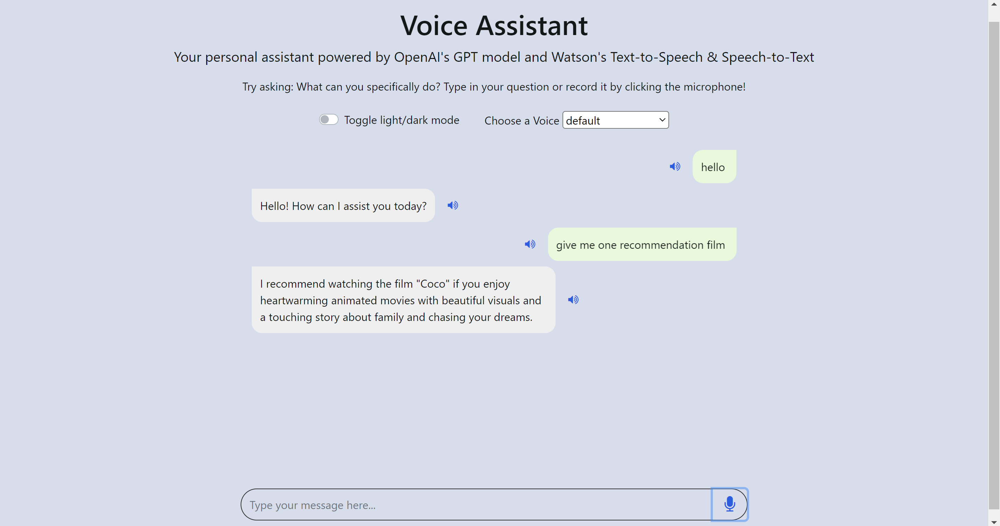

# Voice Assistant with OpenAI's GPT-3 and IBM Watson
<center>  <center>
Link: [Demo](https://ai-personal-assistant.xs6r134s1i6.us-east.codeengine.appdomain.cloud/)
  
<br>Mentee assignment from IBM Advance AI @ Infinite Learning Course completion of Create a Voice Assistant with OpenAI's GPT-3 and IBM Watson from [CognitiveClass.ai](https://cognitiveclass.ai/courses/chatapp-powered-by-openai)

We will build an AI assistant using OpenAI's pre-trained GPT-3 model. Unlike the popular ChatGPT which communicates with text, this personal assistant 
will use voice. We will use Watson Speech-to-Text to give this AI assistant the gift of hearing and Watson Text-to-Speech so that the assistant can read the answers back to you.


## Table of Contents
1. [Mentee Info](#mentee-info)
2. [Technology](#technology)
3. [Setup](#setup)
4. [Usage](#usage)
5. [Project Status](#project-status)
6. [Instructors](#instructors)


<a name="mentee-info"></a>
## Mentee Info
| Nama             | Program              |
| ---------------- | -------------------- |
| Rizqi Hairunnisa | IBM Advance AI 🤖🌊 |


<a name="technology"></a>
## Technology

- Linux/MacOS x86_64
- Flask
- HTML
- CSS
- Javascript
- Python 
- pip
  


<a name="setup"></a>
## Setup
You can setup your project by cloning this repository and install the libraries above.

For specific version of the libraries, please check the `requirements.txt` file. You can install the libraries by using the command below.

```bash
pip install -r requirements.txt
```

<a name="usage"></a>

## Usage
You can run the program by using the command below.

```bash
docker build . -t voice-chatapp-powered-by-openai
```
```bash
docker run -p 8000:8000 voice-chatapp-powered-by-openai
```
Then, open index.html by running new terminal

```bash
start http://localhost:8000
```


<a name="project-status"></a>
## Project Status
Project is: _development phase complete_

<a name="instructors"></a>
## Instructors
- [@Rohit Arora](https://author.skills.network/instructors/rohit_arora)
- [@Talha Siddiqui](https://author.skills.network/instructors/talha_siddiqui)
